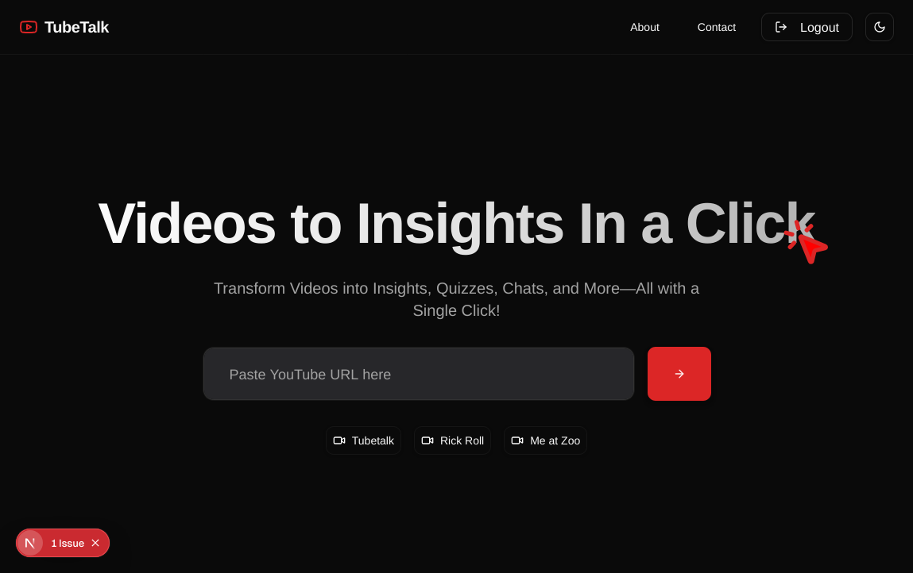

# TubeTalk


### Transform Videos into Insights, Quizzes, Chats, and More—All with a Single Click!

## 🌟 Overview

TubeTalk is a powerful web application and browser extension that transforms YouTube videos into interactive learning experiences. Simply paste a YouTube URL and instantly get:

- 📝 **Concise Summaries** - Get the key points from any video
- 💬 **Interactive Chat** - Ask questions about the video content and get instant answers
- 📊 **Knowledge Quizzes** - Test your understanding with auto-generated quizzes
- 🔍 **Deep Insights** - Discover connections and takeaways you might have missed

Whether you're a student, educator, researcher, or lifelong learner, TubeTalk helps you extract maximum value from video content.

## Contributors

- [Mark Lopes](https://github.com/MarkLopes11)
- [Jonathan Gomes](https://github.com/gomesjonathan99)

## ✨ Features

- **Video Summarization**: Transform lengthy videos into concise, well-structured summaries
- **AI-Powered Chat**: Ask specific questions about the video content and receive accurate answers
- **Quiz Generation**: Test knowledge retention with automatically generated multiple-choice quizzes
- **Chrome Extension**: Access TubeTalk features directly while browsing YouTube
- **Timestamped References**: Easily locate specific moments in the original video
- **Multi-language Support**: Interact with video content in your preferred language
- **Responsive Design**: Works seamlessly across desktop and mobile devices

## 🚀 Getting Started

### Prerequisites

- Node.js (v16+)
- Python (v3.9+)
- Google Gemini API key
- AssemblyAI API key (for advanced transcription)

### Installation

1. Clone the repository:
   ```bash
   git clone https://github.com/yourusername/tubetalk.git
   cd tubetalk
   ```

2. Install backend dependencies:
   ```bash
   cd backend
   pip install -r requirements.txt
   ```

3. Set up environment variables:
   ```bash
   # Create a .env file in the backend directory
   echo "GEMINI_API_KEY=your_gemini_api_key" > .env
   echo "ASSEMBLYAI_API_KEY=your_assemblyai_api_key" >> .env
   ```

4. Install frontend dependencies:
   ```bash
   cd ../web
   npm install
   ```

5. Build and start the application:
   ```bash
   # Start the backend
   cd ../backend
   python main.py
   
   # In a separate terminal, start the frontend
   cd ../web
   npm run dev
   ```

6. For the Chrome extension:
   ```bash
   cd ../extension
   npm install
   npm run build
   ```
   - Load the extension from the `extension/build` directory using Chrome's developer mode

## 🏗️ Architecture

TubeTalk consists of three main components:

1. **Backend (FastAPI)**: Handles video processing, transcription, and AI interactions
2. **Web App (Next.js)**: Provides the main user interface and experience
3. **Chrome Extension**: Allows seamless integration with YouTube browsing

### Technology Stack

- **Frontend**: Next.js, React, TypeScript, Tailwind CSS, Shadcn UI
- **Backend**: FastAPI, LangChain, Google Gemini, AssemblyAI
- **Vector Database**: FAISS for semantic search
- **Database**: PocketBase for user data and content storage
- **Extension**: Vite, React, TypeScript

## 🤝 Contributing

Contributions are welcome! Please feel free to submit a Pull Request.

1. Fork the repository
2. Create your feature branch (`git checkout -b feature/amazing-feature`)
3. Commit your changes (`git commit -m 'Add some amazing feature'`)
4. Push to the branch (`git push origin feature/amazing-feature`)
5. Open a Pull Request

## 📄 License

This project is licensed under the MIT License - see the [LICENSE](LICENSE) file for details.

## 🙏 Acknowledgements

- [Google Gemini](https://ai.google.dev/) for powering the AI capabilities
- [AssemblyAI](https://www.assemblyai.com/) for advanced transcription services
- [YouTube API](https://developers.google.com/youtube/v3) for video data integration
- [Shadcn UI](https://ui.shadcn.com/) for beautiful UI components
- [Aceternity UI](https://ui.aceternity.com/) and [Magic UI](https://magicui.design/) for enhanced frontend components
